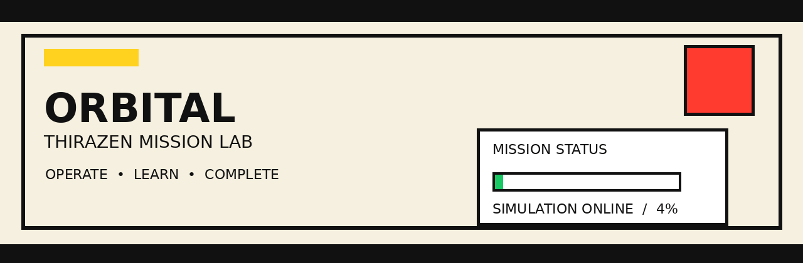

# 🛰️ ORBITAL v0.3 — THIRAZEN Mission Lab



> **Operate. Learn. Complete.**
>
> A neo-brutalist educational spacecraft mission simulator built with React, Vite, Three.js and React Three Fiber.

## 🚀 What is ORBITAL?

ORBITAL turns spacecraft operations into a small interactive learning experience. Instead of only reading instructions, the player uses spacecraft controls and immediately learns what each control does and why it matters.

### Missions

- **LEO-01 — Low-Earth Observation**
- **POLAR-02 — Polar Scan**
- **LUNAR-03 — Lunar Transfer**

Each mission has its own altitude, inclination, fuel profile, objectives and learning context.

## 🎮 Mission flow

1. Open **MISSION** and read the mission brief.
2. Check **WHAT TO DO** for the objective sequence.
3. Use the named spacecraft control.
4. Read **FLIGHT SCHOOL** to learn what that control does.
5. Complete all five objectives.
6. Finish **3/3 orbital passes**.
7. Open **CERTIFICATE**.
8. Enter the recipient name.
9. Print/save the certificate as a single landscape page.

## 🕹️ Controls

| Control | What it does | Learning concept |
|---|---|---|
| **NADIR** | Points the spacecraft toward Earth | Attitude / Earth observation |
| **PROGRADE** | Points along the direction of travel | Orbital motion |
| **RETROGRADE** | Points opposite the direction of travel | Braking / velocity change |
| **SOLAR ARRAY** | Deploys/stows solar panels | Spacecraft power |
| **ANTENNA** | Establishes the communications link | Telemetry |
| **PAYLOAD** | Acquires the mission target | Payload operations |
| **START MISSION** | Starts the simulated mission clock | Orbital passes |
| **RESET MISSION** | Restarts the current mission | Repeatable learning |

## 🧠 Learn while you fly

The **Flight School** panel updates as the player interacts with the spacecraft. It explains:

- why attitude matters,
- how solar arrays provide power,
- what telemetry means,
- what a payload does,
- and what an orbital pass represents.

## 📜 Certificate system

The certificate is a responsive, native layout rather than editable HTML text placed over a pre-rendered certificate image. This prevents duplicated/overlapping recipient and mission text.

Features:

- THIRAZEN branding
- supplied THIRAZEN logo
- supplied Ragul signature asset
- blank recipient field by default
- controlled recipient-name length
- mission ID and certificate ID
- responsive PC/mobile layout
- one-page landscape print layout
- certificate editing/printing unlocks after mission completion

## 🔐 Hidden Mission Override

There is a deliberately hidden maintenance shortcut for testing/demo purposes.

**Click the THIRAZEN logo/mark five times quickly** → the restricted **MISSION OVERRIDE** dialog appears → **EXECUTE OVERRIDE** completes the mission and opens the certificate lab.

It is intentionally not presented as a normal gameplay control.

## 🧱 Tech stack

- React 18
- Vite 6
- Three.js
- React Three Fiber
- Drei
- Responsive CSS
- Browser localStorage for local mission state

## 💻 Run locally

```bash
npm install
npm run dev
```

Then open the local URL shown by Vite.

### Production build

```bash
npm run build
npm run preview
```

## 🌐 GitHub Pages

This repository includes a GitHub Actions workflow at:

```text
.github/workflows/deploy.yml
```

After pushing the repository to GitHub:

1. Open **Settings → Pages**.
2. Set the source to **GitHub Actions**.
3. Push to `main`.
4. GitHub Actions will build and deploy the Vite app.

## 📁 Project structure

```text
ORBITAL_v0.3_THIRAZEN_FINAL/
├── .github/
│   └── workflows/
│       └── deploy.yml
├── public/
│   ├── banner.gif
│   ├── thirazen-logo.png
│   ├── ragul-signature.png
│   ├── certificate-reference.png
│   └── cert-bg.png
├── src/
│   ├── main.jsx
│   └── styles.css
├── index.html
├── package.json
├── vite.config.js
├── .gitignore
└── README.md
```

## 🏷️ Project

**ORBITAL v0.3 — THIRAZEN Mission Lab**  
Educational spacecraft operations simulator / interactive learning project.

---

**THIRAZEN — LEARN • BUILD • BECOME**
